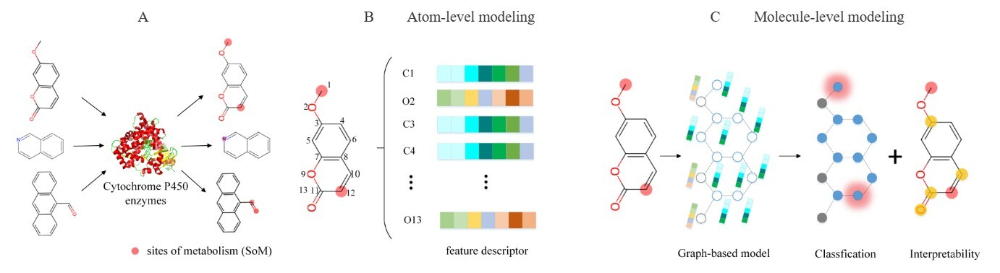

# Improved and Interpretable Prediction of Cytochrome P450-Mediated Metabolism by Molecule-level Graph Modeling

## Data

The original data comes from Zaretzki's dataset and is stored in the ./datasets/merged.sdf file.
The training and testing data is in the same folder.

## Feature
The processing of atom-types, atom-based, and topol-based features is handled in the ./ML/atom_topo_feature.py file.

## Models
Machine learning experiments ML were conducted on three datasets composed of features from different characteristics.
Training script is ./train.ipynb.
The trained model is saved in [zenodo](https://zenodo.org/records/13731719).

## Interpretability
The explanatory files are located in the explain folder, including the interpretability analysis in explainer.py, rdkit_cluster.ipynb for clustering analysis of the original molecules, and rdkit_cluster1.ipynb for clustering analysis of subgraphs composed of important second-order neighbor nodes.

